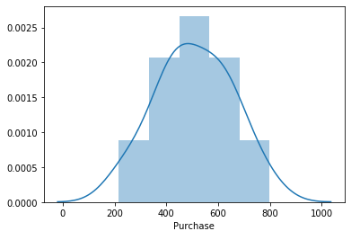
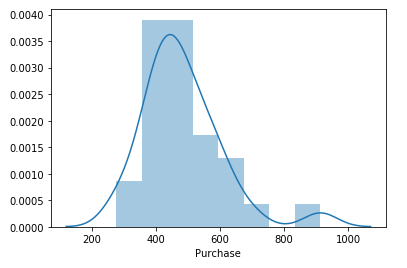
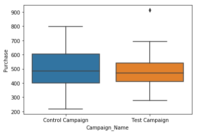

# AB_TEST-and-Facebook-Ad-Analysis

The aim of this project is to measure performance of Facebook advertisement by using AB TEST

# WHAT HAVE BEEN DONE

* Data sets were imported from excel sheet which have two subsheets (Control and Test group)
* The columns of the data sets were renamed.
* There is only one row with NAN values in Control Group so I dropped this row from both of datas.
* I used Independent Two Sample T-Test(AB Test) and checked two Test Assumption Controls. While the assumption of variance homogeneity provides the condition, the normal distribution assumption could not be achieved. 
* Therefore I applied the Non-Parametric test (**mannwhitneyu test**)

# Conclusion

The p-value of mannwhitneyu test is 0.1794. Since pvalue = 0.1794 is greater than alpha = 0.05, The H0 hypothesis cannot be rejected.
So finally we said; There is no statistically significant difference between the the purchase of the control group and the purchase of the test group

# Appendix
        Distribution of The Control Group

       Distribution of The Test Group

       The Box Plot of Purchases in the Groups (A= Control, B= Test)

